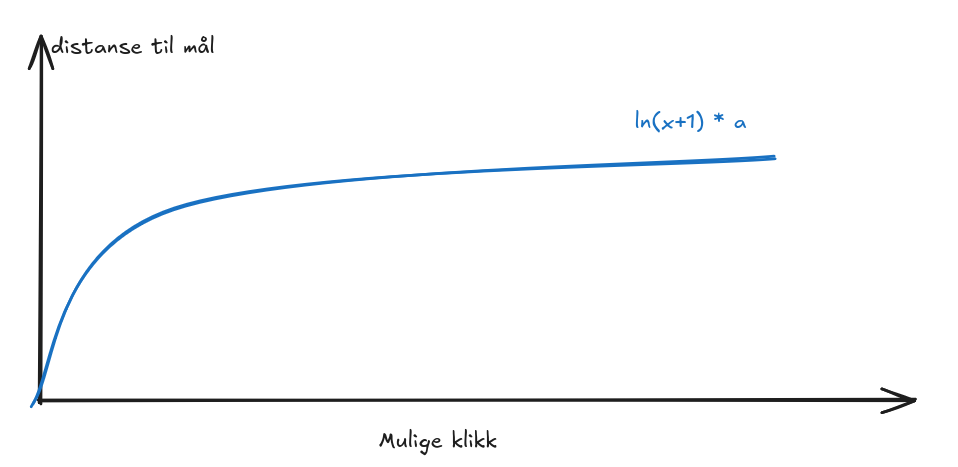

# NRK former - automatisk løser

> NRK former: _"Har du blitt hekta?"_. Nei, eller tja...

Program for å løse dagens brett, og få _"Best i Noreg"_ først!

## Optimaliseringer

* Brettet's state representeres med 4 unsinged integeres, en for hver farge. Hvis en farge eksisterer i en posisjon (x, y) på brettet så setter vi bit (y\*7 + x) i fargen's state til 1. Dette gjøres får å redusere minnebruk, siden A* spiser opp minne veldig kjapt. Bonus: dette gjør noen operasjoner litt kjappere, f.eks, for å sjekke om brettet er ferdig kan man sjekke med binære opperasjoner `blue_state or green_state or pink_state or orange_state == 0`.

* Multithreading med en felles prioritetskø.

* Distansen til mål er den naturlige logaritmen av hvor mange trekk som kan velges mellom. Ved mål vil mulige klikk være 0, og distansen blir også 0 (`ln(1)=0`). Formålet med estimatet er å fange observasjonen om at 25 mulige klikk er ganske likt unna mål som 20 mulige klikk, men 3 mulige klikk er veldig mye nærmere enn 7 mulige klikk. Observasjonen går ut på at sammenhengen med antall mulige klikk og distanse til mål ikke er linjær. Hvis noen har andre ideer til estimat, så er det bare å lage en issue.



_(`a` er en variabel for å justere hvor "lett" man ønsker kjøre pathfinding. Hvis man setter a til noe høyt så vil den overestimere distansen og finne en løsning, men ikke den beste. Trikset er å justere a, slik at distansen blir litt underestimert hvis man ønsker å finne beste løsning)_

## Test programmet

```bash
go run cmd/main.go
```

```text
[info] Distance tuning variable: 4.000000
[info] Number of threads: 8
--- Board ---
O B P G P B O 
O O O P P O P 
B B G O P B B 
O G G G B P O 
P P O B B O G 
G G P O O O P 
G O O G B P O 
B O G G O P G 
P P G P P P O 
--------------

Found solution with length: 13
click 0. (x: 1, y:7)
click 1. (x: 6, y:4)
click 2. (x: 5, y:5)
click 3. (x: 4, y:6)
click 4. (x: 2, y:8)
click 5. (x: 5, y:8)
click 6. (x: 0, y:7)
click 7. (x: 6, y:7)
click 8. (x: 1, y:8)
click 9. (x: 1, y:7)
click 10. (x: 6, y:8)
click 11. (x: 5, y:8)
click 12. (x: 3, y:8)

real	0m0.879s
user	0m5.733s
sys	0m0.517s
```
